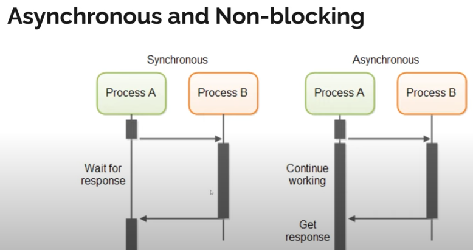
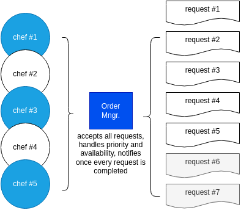
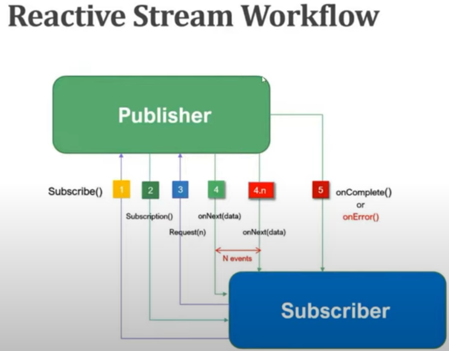

# wflux
WebFlux compendium


---
## Concepts
<b>Reactive programming is a non-blocking technique, asynchronous programming paradigm</b>.

A <b>synchronous</b> programming paradigm is where the program is paused and waits for an event to occur, 
while an <b>asynchronous</b> programming paradigm is where the program is not paused and does not wait for an event to occur.



E.g. having 5 chefs and 1 manager that handles requests, the manager won't be able to accept new requests above 
the maximum number that could be handled in parallel, "i.e. above 5 at the beginning", because using a blocking technique 
it won't be possible to accept 6 or more requests at the same time wih the need of Blocking them
until at least one chef becomes available (probably setting a blocking time period until discard) or Discarding all the new requests above the threshold.
<b>A none blocking technique allows the Manager to accept all requests</b>, handle the processing priority order and availability, 
<b>and then notify the users once every request is being completed</b> -without the need of blocking requests 
until Chefs get available.




---
### a) Why Reactive?
1. Asynchronous and non-blocking
2. Resource efficiency
3. Reduces Back Pressure
4. Better for Streaming Data


---
### b) Reactive Stream Workflow
Publisher/Subscriber reactive Steps:
1. When the <b>Subscriber</b> wants to receive some data, it subscribes to the Publisher, i.e. <code>Subscribe()</code> making the subscription a.k.a. request to the Publisher.
2. Once the <b>Publisher</b> receives the subscribe request from the Subscriber, it acknowledges it, and it sends the <code>subscription</code> a.k.a. response to the Subscriber.
3. After subscription is complete, when the <b>Subscriber</b> wants to receive some data for processing, it makes a <code>Request(n)</code> to the Publisher -being <b>"n"</b> how many data is being requested to the Publisher, e.g. 10 more entries of data.
4. Then <code>onNext()</code> is called on the <b>Subscriber</b> and the Publisher sends the data to the Subscriber -until <b>"n"</b> is reached, e.g. the Subscriber will make up to 10 <code>onNext()</code> calls.
5. Finally, when the <b>Publisher</b> finds that all data has been sent, e.g. the 10 entries where sent, the Publisher lets the Subscriber know that everything is done with <code>onComplete()</code>, i.e. the Request is completed. Also, if it were errors then <code>onError()</code> would be called and the Subscriber could do other things like Retrying.



---
## WebFlux
WebFlux dependency uses <b>Project Reactor</b> as the reactive library, based on Reactive Streams specification, 
for building non-blocking applications on the JVM.

<code>Mono</code> and <code>Flux</code> are the two main types of Reactive Programming:

#### 1. Mono
<code>Mono</code> is a <b>Single Publisher</b> that can return either <b>empty</b> or <b>non-empty</b> data. Used for a ***single entry***.
- ⚠️<code>Mono.just("")</code> doesn't allow null values while <code>Mono.justOrEmpty(null)</code> allows it without throwing error.
- <code>Mono.just("java").log()</code> will log the workflow life cycle after <code>subscribe()</code> is performed, otherwise it doesn't do anything, i.e. the log won't display "java" as no subscription exists.
- <code>Mono.empty()</code> simply returns empty even after subscription -***Note*** <code>onNext()</code> isn't performed when returning empty.
```java
    private Mono<String> verifySingleData(final String value) {
        return Mono
                .justOrEmpty(value)
                .log();
    }

    public static void main(String[] args) {
        var app = new AReactiveDefinitions();
        System.out.println("Mono tests ...");
        app.verifySingleData("java").subscribe(System.out::println);
        app.verifySingleData(null).subscribe(System.out::println);
    }
```
```text
// console output:
Mono tests ...
23:20:30.175 [main] INFO reactor.Mono.Just.1 -- | onSubscribe([Synchronous Fuseable] Operators.ScalarSubscription)
23:20:30.178 [main] INFO reactor.Mono.Just.1 -- | request(unbounded)
23:20:30.180 [main] INFO reactor.Mono.Just.1 -- | onNext(java)
java
23:20:30.180 [main] INFO reactor.Mono.Just.1 -- | onComplete()
23:20:30.181 [main] INFO reactor.Mono.Empty.2 -- onSubscribe([Fuseable] Operators.EmptySubscription)
23:20:30.181 [main] INFO reactor.Mono.Empty.2 -- request(unbounded)
23:20:30.181 [main] INFO reactor.Mono.Empty.2 -- onComplete()
```

#### 2. Flux
<code>Flux</code> is a <b>Stream Publisher</b> that can return either <b>empty</b> or <b>non-empty</b> data. Used for a ***collection of entries***.
- <code>Flux</code> is designed to handle a sequence of elements, including empty sequences, but <b>it does not directly support null values</b>. 
Unlike Mono, which has a <code>Mono.justOrEmpty()</code> method to handle potentially null values, <b>Flux does not have a direct equivalent for handling null elements within its sequence</b>.
Some strategies for handling null values are:
```java
public static void main(String[] args) {
    // alt1: ensure to "filter" data before calling a Publisher creation method, preferably using "fromStream":
    var filtered = Arrays.stream("java", null, "go").filter(Objects::nonNull);
    Flux.fromStream(filtered).log().subscribe(System.out::println);

    // alt2: using "Optional" and "flatMap" converting null to Mono.empty()
    filtered = Arrays.stream("java", null, "go").map(Optional::ofNullable).map(Mono::justOrEmpty).toList();
    Flux.concat(filtered).log().subscribe(System.out::println);

    // alt3: using "map" and replacing nulls with "default" value 
    filtered = Arrays.stream("java", null, "go").map(v -> v != null ? v : "default");
    Flux.fromStream(filtered).log().subscribe(System.out::println);

    // alt4: use defer/lazy from a collection or a stream where null might be present combined with handling null:
    filtered = Arrays.stream("java", null, "go").map(Optional::ofNullable).map(Mono::justOrEmpty).toList();
    Flux.defer(() -> Flux.concat(filtered)).log().subscribe(System.out::println);
}
```
- ⚠️<b>Defer</b>: <code>Flux.defer() and Mono.defer()</code> are methods provided by Project Reactor that allows to create a Flux or Mono lazily, 
meaning the actual creation of the reactive sequence is deferred until a subscriber subscribes to it. 
This can be useful when you want to delay the evaluation of the reactive sequence until it's actually needed, ensuring that the sequence is generated fresh for each new subscriber.
- <code>Flux</code> Publisher can be created using <code>Flux.just(...), Flux.fromIterable(), Flux.fromArray(), or Flux.fromStream(...)</code> methods.
```java
    private Flux<String> verifyCollectionOfData(final String... data) {
        final var filtered = Arrays.stream(data).map(Optional::ofNullable).map(Mono::justOrEmpty).toList();
        return Flux.defer(() -> Flux.concat(filtered)).log();
    }

    public static void main(String[] args) {
        var app = new AReactiveDefinitions();
        System.out.println("Flux tests ...");
        app.verifyCollectionOfData("java", null, "go").subscribe(System.out::println);
    }
```
```text
// console output:
Flux tests ...
23:58:53.091 [main] INFO reactor.Flux.Defer.3 -- onSubscribe(FluxConcatIterable.ConcatIterableSubscriber)
23:58:53.091 [main] INFO reactor.Flux.Defer.3 -- request(unbounded)
23:58:53.091 [main] INFO reactor.Flux.Defer.3 -- onNext(java)
java
23:58:53.091 [main] INFO reactor.Flux.Defer.3 -- onNext(go)
go
23:58:53.091 [main] INFO reactor.Flux.Defer.3 -- onComplete()
```

***Important Note***  
⚠️The <b>[Reactive Streams Specification](https://www.reactive-streams.org/)</b> mandates that null values are not permitted in reactive streams to avoid ambiguity and potential errors during stream processing.

***Note*** <code>onNext()</code> isn't performed when returning empty.


---
#### Map and FlatMap
<code>.map() and .flatMap()</code> <b>Conversion Methods</b> are also supported after publisher/stream creation, i.e. using <code>Flux.fromIterable(...).flatMap(...)</code> -e.g. for returning <code>Mono</code> with only people's names of a list of persons- or <code>Mono.just(...).map(...)</code> -e.g. for returning the wrapped Person of an <code>Optional</code>-.
```java
    private Flux<String> getNames(final List<Optional<Person>> people) {
        return Flux
                .fromIterable(people)
                .filter(Optional::isPresent)
                .map(Optional::get)
                .flatMap(p -> Mono.justOrEmpty(p.fullName()))
                .log();
    }

    public static void main(String[] args) {
        var app = new AReactiveDefinitions();
        System.out.println("Map and FlatMap tests ...");
        app.getNames(List.of(Optional.of(new Person("Cami", 10)),
                Optional.empty(),
                Optional.of(new Person("Male", 22)))).subscribe(System.out::println);
    }
    
    record Person(String fullName, int age) {}
```
```text
// console output:
Map and FlatMap tests ...
12:33:16.972 [main] INFO reactor.Flux.FlatMap.4 -- onSubscribe(FluxFlatMap.FlatMapMain)
12:33:16.972 [main] INFO reactor.Flux.FlatMap.4 -- request(unbounded)
12:33:16.972 [main] INFO reactor.Flux.FlatMap.4 -- onNext(Cami)
Cami
12:33:16.972 [main] INFO reactor.Flux.FlatMap.4 -- onNext(Male)
Male
12:33:16.972 [main] INFO reactor.Flux.FlatMap.4 -- onComplete()
```


---
#### Skip and Delay Elements
<code>Flux</code> has <b>skip</b> and <b>delayElements</b> methods that are used to skip elements or delay the emission of them respectively.
- <code>.skip(...)</code> is a method overloaded with many options/conditions to <b>skip elements already emitted</b> within a Reactive Stream a.k.a. skipping the <code>onNext()</code> call and is being added after creating Flux or Mono streams/Publishers for changing the behaviour of the Workflow.
- <code>.delayElements(...)</code> is another method being added after creating Flux or Mono streams/Publishers for changing the behaviour of the Workflow <b>adding time before emitting each element</b>.

E.g. adding <b>Delay</b> before the emission of each of the elements of the stream but taking into account that some of them will be <b>Skipped</b> within an specified time window, i.e. Flux will ignore all elements emitted during the initial duration and only start emitting after that period has elapsed. 
```java
    private Flux<String> getCertainDataWithDelay(final String... data) {
        return Flux.just(data)
                // add Delay of 300 milliseconds among the emission of each element:
                .delayElements(Duration.ofMillis(300))
                // only start emitting after 1 second has elapsed, i.e. the 1st 3 elements emitted will always be ignored:
                .skip(Duration.ofSeconds(1))
                .log();
    }

    public static void main(String[] args) throws InterruptedException {
        var app = new AReactiveDefinitions();
        System.out.println("Delay and Skip tests ...");
        // Total duration of emission is "1.5" seconds but the elements emitted inside "1" second window will be ignored:
        app.getCertainDataWithDelay("cpp", "python", "javascript", "java", "go").subscribe(System.out::println);
        // Requirement!!!: Wait for "2" seconds to allow the emission of the elements according to de delay established above.
        // Otherwise, the elements won't be emitted as the Main thread will exit immediately because the Stream Workflow runs in parallel -Child thread.
        TimeUnit.SECONDS.sleep(2);
    }
```
```text
// console output:
Delay and Skip tests ...
11:41:00.517 [main] INFO reactor.Flux.SkipUntilOther.5 -- onSubscribe(SerializedSubscriber)
11:41:00.517 [main] INFO reactor.Flux.SkipUntilOther.5 -- request(unbounded)
11:41:01.748 [parallel-5] INFO reactor.Flux.SkipUntilOther.5 -- onNext(java)
java
11:41:02.063 [parallel-6] INFO reactor.Flux.SkipUntilOther.5 -- onNext(go)
go
11:41:02.063 [parallel-6] INFO reactor.Flux.SkipUntilOther.5 -- onComplete()
```

-  <code>skipWhile(predicate ...) and skipUntil(predicate ...)</code> are methods that allows to skip elements in a Flux based on a predicate condition. 
They differ in how they determine which elements to skip, i.e. in <code>skipWhile</code> ignores elements as long as the given predicate returns true and in <code>skipUntil</code> ignores elements until the given predicate returns true.
- <code>range</code> method is used to create a Flux of Integers from a <b>Starting</b> position and a <b>Count</b> of elements.
```java
    private Flux<Integer> skipWhileAndUntil(final int whileStart, final int untilStart,
                                            final int whileVal, final int untilVal) {
        var f1 = Flux.range(whileStart, 10*whileStart).skipWhile(n -> n < whileVal);
        // ⚠️Note last argument of Range is "count" and NOT "end position",
        // i.e. Starts at "100" having a Count of "1000" elements:
        // Result=100, 101, 102, ..., 1097, 1098, 1099 -1099 is the 1000th element in the sequence.
        var f2 = Flux.range(untilStart, 10*untilStart).skipUntil(n -> n >= untilVal);
        return Flux.concat(f1, f2);
    }

    public static void main(String[] args) throws InterruptedException {
        var app = new AReactiveDefinitions();
        System.out.println("SkipWhile and SkipUntil tests ...");
        app.skipWhileAndUntil(1, 100, 7, 1097).subscribe(System.out::println);
        System.out.println("...");
        app.skipWhileAndUntil(1, 1, 7, 7).subscribe(System.out::println);
    }
```
```text
// console output:
SkipWhile and SkipUntil tests ...
7
8
9
10
1097
1098
1099
...
7
8
9
10
7
8
9
10
```


---
#### Concat and Merge 
- <code>concat</code> method <b>combines multiple Flux streams into one</b>, but it does so <b>sequentially</b>, i.e. it will wait for the first Flux to complete before starting to emit elements from the next Flux.
<b>Sequentially concatenates multiple Flux streams</b>, emitting all elements from one Flux before starting the next.
<b>Useful when the order of elements matters</b> and you want to maintain the complete sequence from one Flux before moving to the next.
- <code>merge</code> method <b>combines multiple Flux streams into one</b>, <b>interleaving their elements as they are emitted</b>, i.e. elements from all source <b>Flux streams are emitted as soon as they are available, without waiting for one stream to complete</b> before starting the next.
<b>Interleaves</b> elements from multiple Flux streams as they are emitted.
<b>Useful when you want to process elements as soon as they become available</b>, regardless of the source.
```java
    private Flux<Integer> unionAll(final int start0, final int start1, final int count,
                                  final Duration delay, final InsertMode mode) {
        var f1 = Flux.range(start0, count).delayElements(delay);
        var f2 = Flux.range(start1, count).delayElements(delay.plusMillis(50));
        // enhanced "switch"
        return switch (mode) {
            case CONCAT -> Flux.concat(f1, f2);
            case MERGE -> Flux.merge(f1, f2);
        };
    }

    public static void main(String[] args) throws InterruptedException {
        var app = new AReactiveDefinitions();
        System.out.println("Concat and Merge tests ...");
        app.unionAll(1, 101, 5, Duration.ofMillis(100), InsertMode.CONCAT).subscribe(System.out::println);
        TimeUnit.SECONDS.sleep(2);
        System.out.println("...");
        app.unionAll(1, 101, 5, Duration.ofMillis(100), InsertMode.MERGE).subscribe(System.out::println);
        // Requirement!!!: Wait for 2 seconds to allow the emission of the elements according to de delay established above.
        // Otherwise, the elements won't be emitted as the main thread will exit immediately.
        TimeUnit.SECONDS.sleep(2);
    }
    
    enum InsertMode { CONCAT, MERGE }
```
```text
// console output:
Concat and Merge tests ...
1
2
3
4
5
101
102
103
104
105
...
1
101
2
102
3
4
103
5
104
105
```


---
#### Zip
<code>zip</code> function is used to <b>combine multiple Flux or Mono streams into a single stream</b>, 
<b>emitting elements as a tuple or applying a specified combinator function</b>.

<code>zip</code> function <b>waits until all the streams emit their next element and then combines these elements into a single output</b>.

<b>Key Characteristics:</b>
1. <b>Synchronization</b>: <code>zip</code> synchronizes the emissions of multiple publishers (i.e., Flux or Mono). 
It waits until all sources have emitted an element before combining them.
2. <b>Combination</b>: <code>zip</code> by default, it produces a Tuple containing the elements from each source ***-from a Minimum of 2 to 8 sources Maximum, i.e. returning from Tuple2 ... to Tuple8-***.
Alternatively, you can provide a combinator function to process the elements from the sources and return a combined result.
3. ⚠️<b>Completes on Shortest Stream</b>: <b>If one of the sources completes before the others, the resulting Flux will complete immediately</b>, and no further combinations are emitted.
```java
    private Flux<Tuple2<Integer, Integer>> combine(final int start0, final int start1, final int count) {
        var f1 = Flux.range(start0, count);
        var f2 = Flux.range(start1, count);
        // default behaviour
        return Flux.zip(f1, f2);
    }

    private Flux<String> combineToSingle(final Integer[] data0, final String... data1) {
        var f1 = Flux.fromArray(data0);
        var f2 = Flux.just(data1);
        // using a combination function:
        return Flux.zip(f1, f2, (n, s) -> (n + "-" + s).toUpperCase());
    }

    public static void main(String[] args) {
        var app = new AReactiveDefinitions();
        System.out.println("Zip tests ...");
        app.combine(1, 101, 5).subscribe(System.out::println);
        System.out.println("...");
        // it will only combine 1st 3 elements because when the shortest stream completes, the rest will be ignored:
        app.combineToSingle(new Integer[]{1, 2, 3, 4, 5}, "a", "b", "c").subscribe(System.out::println);
    }
```
```text
// console output:
Zip tests ...
[1,101]
[2,102]
[3,103]
[4,104]
[5,105]
...
1-A
2-B
3-C
```

<b>Use Cases:</b>
- <b>Combine Related Data</b>: Zipping is useful to combine related pieces of data that are emitted from different sources simultaneously.
- <b>Synchronization</b>: To process elements from multiple sources together in a synchronized fashion, ensuring that each combined element is processed together.

In summary, <b>zip</b> is used often when there is a need to coordinate multiple asynchronous streams of data.


---
#### Collect List and Block
- <code>collectList</code> function is used to <b>collect all the elements emitted by a Flux or Mono into a Observable List</b>, i.e. 
takes all elements emitted by a `Flux<T>` or `Mono<T>` and return it as a `Mono<List<T>>`.
- <code>block</code> method is used to <b>block the current thread until the Mono or Flux completes and returns a result</b>. 
This is a <b>way to transform the reactive, non-blocking code into a blocking, synchronous call</b>, which can be useful in certain scenarios, 
e.g. testing or integrating with legacy code resulting into direct <code>java.util.List</code>.
```java
    private Mono<List<Integer>> collectAsSingle(final Integer[] data, final Duration delayElements) {
        // from Flux to Mono
        return Flux
                .fromArray(data)
                .delayElements(delayElements)
                // returns a Observable none blocking operation as a Mono "single" Stream
                .collectList()
                .log();
    }

    public static void main(String[] args) {
        var app = new AReactiveDefinitions();
        System.out.println("Collect tests ...");
        // instead of subscribing to the Mono<List> none blocking operation a
        // "block" operation is performed to convert to a single java.util.List "blocking current thread",
        // which will wait until the Mono<List> is completed so there is no need to set a Time-Out above 1 second:
        List<Integer> legacyList = app.collectAsSingle(new Integer[]{1, 2, 3, 4}, Duration.ofMillis(250)).block();
        System.out.println(legacyList);
    }
```
```text
// console output:
Collect List and Block tests ...
12:23:57.651 [main] INFO reactor.Mono.CollectList.6 -- | onSubscribe([Fuseable] MonoCollectList.MonoCollectListSubscriber)
12:23:57.651 [main] INFO reactor.Mono.CollectList.6 -- | request(unbounded)
12:23:58.701 [parallel-6] INFO reactor.Mono.CollectList.6 -- | onNext([1, 2, 3, 4])
12:23:58.701 [parallel-6] INFO reactor.Mono.CollectList.6 -- | onComplete()
[1, 2, 3, 4]
```

***Notes about Block***
- Using <code>block()</code> on a `Mono<T>`, it will wait until the Mono emits a value and then return that value. 
If the Mono is empty, it will return null.
- Using <code>block()</code> on a `Flux<T>`, it will wait until the Flux completes and return the first emitted element. 
If the Flux is empty, it will return null.
- ⚠️<code>block()</code> in a reactive application <b>can defeat the purpose of non-blocking I/O and reactive programming, as it will block the thread and can lead to performance issues if used improperly</b>. 
It is generally discouraged in production code, especially in a fully reactive environment.


---
#### Buffer
<code>buffer()</code> method is used <b>to collect elements emitted by a Flux into batches (or "buffers") based on certain conditions</b>, 
such as a specific size, time duration, or when a particular event occurs.
This can be <b>useful for processing a "batch" of elements together instead of handling each one individually as they arrive</b>.
E.g. create batches of 3 elements from a range of 1 to 10:
```java
public static void main(String[] args) {
    Flux.range(1, 10)
            .buffer(3)
            .subscribe(System.out::println);
}
```
```text
//console output:
[1, 2, 3]
[4, 5, 6]
[7, 8, 9]
[10]
```
***Note*** the default 'buffer' behaviour creates a single "batch" including all elements if no condition is provided.

In addition, is possible to *Buffer by Time*, i.e. collecting elements emitted within a specific time window.
E.g. create batches every 300 milliseconds from a 'take' of 10 (0 - 9) having 'interval' delay of 100 milliseconds:
```java
public static void main(String[] args) {
    Flux.interval(Duration.ofMillis(100))
            .take(10)
            .buffer(Duration.ofMillis(300))
            .subscribe(System.out::println);
}
```
```text
//console output:
[0, 1, 2]
[3, 4, 5]
[6, 7, 8]
[9]
```
Other useful methods are *Buffer by Size and Time*, i.e. <code>.bufferTimeout(3, Duration.ofMillis(300))</code>, 
and *Buffer Until or While a Predicate is True*. 
```java
    private Flux<List<Long>> buffer(final long take, final Duration interval, final Duration batch) {
        return Flux.interval(interval)
                .take(take)
                .buffer(batch);
    }

    public static void main(String[] args) throws InterruptedException {
        var app = new AReactiveDefinitions();
        System.out.println("Buffer tests ...");
        // emit 5 elements in intervals every 100 millisecond and buffer every 210 milliseconds, i.e. creating 3 batches:
        app.buffer(5, Duration.ofMillis(100), Duration.ofMillis(210)).subscribe(System.out::println);
        TimeUnit.SECONDS.sleep(1);
    }
```
```text
// console output:
Buffer tests ...
[0, 1]
[2, 3]
[4]
```


---
#### Collect Map
<code>collectMap()</code> operator is used to <b>collect the elements emitted by a Flux into an Observable Map</b>, 
i.e. takes all elements emitted by a `Flux<T>` or `Mono<T>` and return it as a `Mono<Map<K, V>>`. 
This allows to create a Map where each <b>key is derived from the elements of the Flux, and each value is the corresponding element or derived from it</b>.
<code>collectMap()</code> takes <b>two main arguments</b>:
- ⚠️Required: A ***key mapping function*** that determines how each element in the Flux will be mapped to a Key in the resulting Map.
- (Optional): A ***value mapping function*** that determines how each element will be mapped to a Value in the resulting Map. 
If not provided, the elements themselves are used as values.
```java
    private Mono<Map<String, String>> collectAsSingleByKey(final List<Person> people) {
        return Flux.fromIterable(people)
                .collectMap(p -> p.id, Person::fullName);
    }
    
    public static void main(String[] args) throws InterruptedException {
        var app = new AReactiveDefinitions();
        System.out.println("Collect Map tests ...");
        app.collectAsSingleByKey(List.of(new Person("Cami", 10),
                        new Person("Ema", 10),
                        new Person("Male", 22)))
                .subscribe(System.out::println);
    }

    record Person(String id, String fullName, int age) {
    
        Person(final String fullName, final int age) {
            this(UUID.randomUUID().toString(), fullName, age);
        }
    }
```
```text
// console output:
Collect Map tests ...
{1130dc87-1efd-4666-abdb-6f9574dab316=Cami, e845a5ad-3e29-4f5c-a6d4-d5310475b543=Ema, f36758b6-6e55-43f0-a180-1c394b2129f0=Male}
```
***Notes***
- ⚠️If multiple elements have the same key, the later one will overwrite the earlier one.
- The resulting `Mono<Map<K, V>>` will contain the final Map after all elements have been processed.

<b>This method is particularly useful when you need to transform a stream of elements into a Map for quick lookups based on a certain property of the elements</b>. 
E.g., use `collectMap()` to create a lookup table from a list of objects based on their IDs.


---
#### Do Functions
<b>These operators provide hooks into the reactive stream's lifecycle and are invaluable for adding side effects 'without altering the stream's behavior'</b>.
- `doOnNext`: React to each item emitted (called each time an item is emitted by the publisher). 
- `doOnError`: Handle errors (when an error occurs in the stream). 
- `doOnComplete`: Perform an action on completion (when the stream completes successfully). 
- `doOnSubscribe`: React to the beginning of a subscription (invoked when a subscription to the publisher occurs). 
- `doOnTerminate`: Perform an action on termination, regardless of how it happens (either by completing or by encountering an error). 
- `doOnCancel`: Handle subscription cancellation. 
- `doFinally`: Guaranteed cleanup or final action (regardless of whether the stream completes, errors, or is canceled).

These `doOn` operators allow to add side effects at various stages of a reactive stream's lifecycle, 
often <b>used for logging, debugging, updating metrics, or performing additional actions based on the specific event in the stream</b>.
- `doOnEach`: In addition, the `doOnEach` operator <b>allows to add a side effect that occurs when a signal "onNext, onError, or onComplete" is received</b> 
in a reactive stream. Often used for logging or performing additional actions based on the signal emitted.
```java
    private Flux<String> logSignals(final String... data) {
        return Flux.fromArray(data).doOnEach(s -> {
            System.out.println("Signal: " + s);
            if (s.isOnNext()) {
                System.out.println("Received value: " + s.get());
            } else if (s.isOnError()) {
                System.err.println("Error: " + s.getThrowable());
            } else if (s.isOnComplete()) {
                System.out.println("Stream completed");
            }
        });
    }

    public static void main(String[] args) throws InterruptedException {
        var app = new AReactiveDefinitions();
        System.out.println("Do On tests ...");
        // no need to do .subscribe(System.out::println) as logging and metrics are performed inside "doOnEach"
        app.logSignals("java", "go", "cpp").subscribe();
    }
```
```text
// console output:
Do On tests ...
Signal: doOnEach_onNext(java)
Received value: java
Signal: doOnEach_onNext(go)
Received value: go
Signal: doOnEach_onNext(cpp)
Received value: cpp
Signal: onComplete()
Stream completed
```


---
#### Error Handling
<b>Once an error happens the entire Stream will be interrupted</b>, i.e. it will stop emitting next elements.  

<b>`onError and retry` operators help ensure that reactive streams are resilient and can recover from failures in a controlled way</b>:
- `onErrorContinue`: Skips over errors and continues processing remaining (used to continue processing the stream even if certain elements cause an error).
- `onErrorReturn`: Provides a default value when an error occurs (to replace an error with a specific default value).
- `onErrorResume`: Switches to a fallback sequence in case of an error (to continue the stream with a fallback sequence after an error). 
- `onErrorMap`: Maps the error to another exception or provides more context (to change the type of the exception or provide additional context in the error). 
- `retry`: Retries the entire sequence upon an error (automatically retry the operation before giving up, using default strategy, e.g. 3 retries). 
- `retryWhen`: Custom retry logic/strategy with more control (used for fine-grained control over retry logic, such as adding delays or exponential backing off between retries).

These operators provide robust ways to handle errors in your reactive streams, ensuring that your application can recover gracefully from unexpected situations.
```java
    private Flux<String> getNamesWithFallbacks(final List<Person> people) {
        return Flux.fromIterable(people)
                .map(Person::fullName)
                .onErrorResume(e -> {
                    System.out.println("Error occurred, switching to Fallback stream, detail: " + e.getMessage());
                    return Flux.just("Mili", "Sol");
                });
    }

    public static void main(String[] args) throws InterruptedException {
        var app = new AReactiveDefinitions();
        app.getNamesWithFallbacks(List.of(new Person("Cami", 10),
                // null value mapping error will occur in this position so the fallback stream process will be triggered:
                new Person(null, 0),
                new Person("Male", 22))).subscribe(System.out::println);
    }

    record Person(String id, String fullName, int age) {
        Person(final String fullName, final int age) {
            this(UUID.randomUUID().toString(), fullName, age);
        }
    }
```
```text
// console output:
On Error tests ...
Cami
Error occurred, switching to Fallback stream, detail: The mapper [org.wflux.demo.AReactiveDefinitions$$Lambda/0x0000023dde0babc8] returned a null value.
Mili
Sol
```


---
### Requirements
1. ⚠️Docker must be running before executing Application.
2. <code>docker-compose -f mongo.yml up -d</code> before running tests. 

***Optional***: Running under WSL needs allowing traffic through the firewall, i.e. using PS <code>New-NetFirewallRule -DisplayName "Allow MongoDB" -Direction Inbound -LocalPort 27017 -Protocol TCP -Action Allow</code>.  


---
### Further samples
***Forked Repository***

[Reactive Programing, JWT, MSA and OAuth](https://github.com/paguerre3/Spring-Boot-Tutorials)


